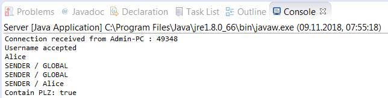

# 🖥 Multithreading Chat Server Java 🖥
🖥 A simple Chat Server in Java, implemented with the Observer pattern 🖥

## 🖼 Images 🖼

### [👥 Client 👥](https://github.com/AYIDouble/Multithreading-Chat-Client-Java)

<h1 align=center>

</h1>
<h1 align=center>

</h1>
<h1 align=center>

</h1>

### 🖥 Server 🖥

<h1 align=center>

</h1>

